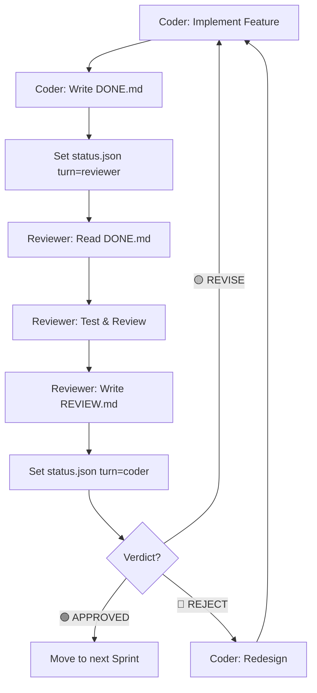

# 🔄 MeeSai Dual-Agent Protocol

> Coder Agent ↔ Reviewer Agent Communication Standard

## Architecture

```
┌─────────────┐    .agent/handoff/     ┌──────────────┐
│ CODER AGENT │ ──── DONE.md ────────▸ │REVIEWER AGENT│
│  (Tab 1)    │ ◂── REVIEW.md ─────── │   (Tab 2)    │
│             │                        │  🎩 Executive│
│ Implements  │    .agent/status.json  │  🧢 Renter   │
│ code        │ ◂──────────────────▸   │  👒 Owner    │
└─────────────┘                        └──────────────┘
```

## File Structure

```
meesai/.agent/
├── AGENT_PROTOCOL.md        # ← เอกสารนี้
├── status.json              # สถานะปัจจุบัน (ใครกำลังทำอะไร)
└── handoff/
    ├── DONE.md              # Coder → Reviewer (ส่งมอบงาน)
    └── REVIEW.md            # Reviewer → Coder (ส่ง feedback)
```

---

## 1. `status.json` — Agent State

ไฟล์นี้บอกว่าตอนนี้ใครควรทำงาน:

```json
{
  "turn": "coder",
  "sprint": "3.3",
  "feature": "Booking Logic",
  "lastUpdate": "2026-02-09T20:00:00+07:00",
  "cycle": 1
}
```

| Field | Values |
|:---|:---|
| `turn` | `"coder"` or `"reviewer"` |
| `sprint` | Sprint ปัจจุบัน |
| `feature` | ฟีเจอร์ที่กำลังทำ |
| `cycle` | รอบ review (1 = ส่ง review ครั้งแรก, 2 = แก้ไขแล้วส่งอีกครั้ง) |

---

## 2. `DONE.md` — Coder → Reviewer

เมื่อ Coder ทำเสร็จ sprint/feature จะสร้างไฟล์นี้:

```markdown
# ✅ DONE — Sprint 3.3: Booking Logic

## สรุปสิ่งที่ทำ
- สร้าง booking flow (เลือกชุด → เลือกวัน → ชำระเงิน)
- Server Actions: createBooking(), cancelBooking()
- Concurrency Control: optimistic lock ด้วย version field

## ไฟล์ที่เปลี่ยน
| File | Change |
|:---|:---|
| `src/actions/booking.ts` | [NEW] Booking Server Actions |
| `src/app/[locale]/booking/page.tsx` | [NEW] Booking page |
| `prisma/schema.prisma` | [MODIFY] Added version field |

## ขอให้ Review
- [ ] 🎩 Business: booking flow สร้างรายได้จริงไหม?
- [ ] 🧢 UX: ลูกค้าจองง่ายไหม? กี่คลิก?
- [ ] 👒 Owner: เจ้าของร้านเห็นยอดจองเรียลไทม์ไหม?

## Test Credentials
| Role | Phone | Password |
|:---|:---|:---|
| Admin | 02099990001 | meesai123 |
| Renter | 02077772001 | meesai123 |

## Live URL
https://meesai.vgroup.work
```

---

## 3. `REVIEW.md` — Reviewer → Coder

Reviewer จะสร้างไฟล์นี้หลัง review เสร็จ:

```markdown
# 📋 REVIEW — Sprint 3.3: Booking Logic

## Verdict: 🟡 REVISE (or 🟢 APPROVED / 🔴 REJECT)

## 🎩 Executive Review
- ✅ Booking flow สร้างรายได้ได้จริง
- ⚠️ ยังไม่มี deposit collection → ถ้าลูกค้าจองแล้วไม่มา จะเสียโอกาส
- **Action Required:** เพิ่ม deposit payment step ก่อน confirm

## 🧢 Renter Review
- ✅ UI สวย จองง่าย 3 คลิก
- ⚠️ ไม่มี calendar view → ลูกค้าไม่เห็นว่าวันไหนว่าง
- **Action Required:** เพิ่ม availability calendar

## 👒 Owner Review
- ✅ Dashboard มียอดจอง
- ⚠️ ไม่มี notification เมื่อมีคนจองชุด
- **Action Required:** เพิ่ม push notification / LINE notify

## Priority Actions (Coder ต้องทำ)
1. 🔴 **MUST** — Deposit payment step
2. 🟡 **SHOULD** — Availability calendar
3. 🟢 **NICE** — LINE notification (ย้ายไป Sprint 3.4)

## Files to Review
- `src/actions/booking.ts` line 45: race condition ถ้า 2 คนจองพร้อมกัน
- `src/app/[locale]/booking/page.tsx` line 120: ไม่มี loading state
```

---

## 4. Workflow Loop



## 5. Rules

### Coder Agent Rules
1. เมื่อเห็น `REVIEW.md` → อ่าน feedback → แก้ไข → เขียน `DONE.md` ใหม่
2. แก้ไขตาม Priority: 🔴 MUST ก่อน → 🟡 SHOULD → 🟢 NICE (ย้ายไป backlog)
3. ลบ `REVIEW.md` หลังอ่านเสร็จ เพื่อป้องกัน stale feedback
4. อัพเดท `status.json` ทุกครั้งที่ส่งมอบงาน

### Reviewer Agent Rules
1. เมื่อเห็น `DONE.md` → อ่าน → ทดสอบ → เขียน `REVIEW.md`
2. Review จาก 3 มุมมอง: 🎩 Executive, 🧢 Renter, 👒 Owner
3. ให้ Verdict: 🟢 APPROVED / 🟡 REVISE / 🔴 REJECT
4. ลบ `DONE.md` หลังอ่านเสร็จ
5. อัพเดท `status.json` ทุกครั้งที่ส่ง review

### Shared Rules
- อ่าน `status.json` ก่อนเริ่มทำงานทุกครั้ง
- ถ้า `turn` ไม่ใช่ของตัวเอง → **รอ** (แจ้ง user)
- ถ้าทั้ง 2 ไฟล์มีอยู่พร้อมกัน → **conflict** → ให้ user ตัดสิน
