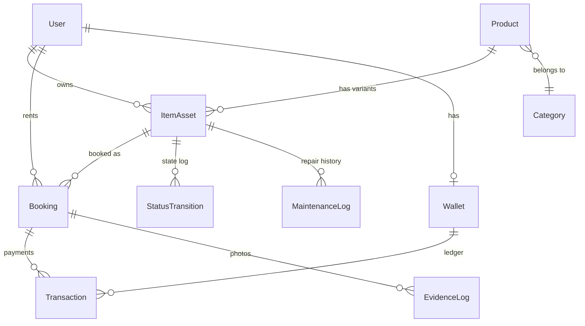

# Business Architecture — MeeSai Platform

> ออกแบบตาม 5 เสาเข็กเทคนิค (Executive Blueprint) + ปรับให้เหมาะกับ Next.js + Prisma

---

## เสาที่ 1: Concurrency Control & Booking Logic

### ปัญหา: Double Booking
ลูกค้า 2 คนกดจองชุดตัวเดียวกัน หรือจองคร่อมวันที่ชุดยังซักไม่เสร็จ

### ทางแก้: Time-based Locking + Buffer Time

```sql
-- Availability Check Query (ใช้ก่อนยืนยันจอง)
SELECT COUNT(*) FROM bookings
WHERE item_asset_id = ?
  AND status NOT IN ('CANCELLED')
  AND pickup_date < :RequestedReturnDate
  AND buffer_end > :RequestedPickupDate
```

- ถ้า count > 0 = **ไม่ว่าง**
- `buffer_end` = `return_date + 2 วัน` (เผื่อซักอบรีด)
- ใช้ Prisma `$transaction` + `SELECT FOR UPDATE` ป้องกัน race condition

### Implementation
- Server Action: `checkAvailability(assetId, pickupDate, returnDate)`
- Server Action: `createBooking()` ใช้ `prisma.$transaction()` ครอบทั้ง check + insert
- ค่า Buffer Days เก็บใน `SystemConfig` table → ปรับได้จาก Admin

---

## เสาที่ 2: Finite State Machine (FSM)

### ปัญหา: สถานะมั่ว
ชุดยังซักไม่เสร็จ แต่ขึ้นว่า "พร้อมเช่า" ในแอป

### ทางแก้: Enforced State Transitions

```
AVAILABLE → RESERVED → PICKED_UP → RETURNED → IN_QC → CLEANING → AVAILABLE
                                                          ↓
                                                       DAMAGED → MAINTENANCE → AVAILABLE
                                                                      ↓
                                                                   RETIRED
```

### Transition Rules (ข้ามขั้นไม่ได้)
| From | Allowed To |
|:---|:---|
| `AVAILABLE` | `RESERVED` |
| `RESERVED` | `PICKED_UP`, `AVAILABLE` (cancel) |
| `PICKED_UP` | `RETURNED` |
| `RETURNED` | `IN_QC` |
| `IN_QC` | `CLEANING`, `DAMAGED` |
| `CLEANING` | `AVAILABLE` |
| `DAMAGED` | `MAINTENANCE` |
| `MAINTENANCE` | `AVAILABLE`, `RETIRED` |

### Implementation
- ฟังก์ชัน `transitionAssetStatus(assetId, newStatus)` ตรวจ current → new
- ถ้า transition ไม่ valid → throw Error ทันที
- ทุก transition บันทึกลง `StatusTransition` table (who, when, from, to)

---

## เสาที่ 3: Inventory Unique Identification

### ปัญหา: ชุดเดียวกัน 10 ตัว แต่ตัวที่ 3 ซิปแตก
ระบบรู้แค่ "ชุดแบบนี้มี 10" แต่ไม่รู้ว่า **ตัวไหน** มีปัญหา

### ทางแก้: แยก Product (SKU) vs ItemAsset (ตัวจริง)

```
Product (แสดงหน้าเว็บ)          ItemAsset (ตัวจริงในคลัง)
├── ชื่อ, รูป, ราคา              ├── Asset UUID (Barcode/RFID)
├── Size S/M/L                   ├── เจ้าของ (Owner)
├── Category                     ├── เกรด (A/B/C)
└── ราคาเช่าแนะนำ               ├── ประวัติการซ่อม
                                 ├── รอบการซัก
                                 └── สถานะ FSM
```

### ประโยชน์
- เกิดปัญหา → รู้ว่า **"ชุดตัวนี้ ของนาย ก. เสียหาย"**
- หักเงินประกัน → ผูกกับ Asset ID ที่เฉพาะเจาะจง
- Booking ผูกกับ `ItemAsset` ไม่ใช่ `Product`

---

## เสาที่ 4: Double-Entry Ledger (ระบบบัญชีคู่)

### ปัญหา: เงินหาย / ยอดไม่ตรง / Audit ไม่ได้

### ทางแก้: ใช้ Transaction Log แทน balance field

```
Transaction Table (Append-only, ห้ามลบ)
├── source_wallet_id    (จ่าย)
├── dest_wallet_id      (รับ)
├── amount
├── type                (RENTAL_PAYMENT, OWNER_EARNING, PLATFORM_FEE, DEPOSIT, DEPOSIT_REFUND, PAYOUT)
├── reference_id        (booking_id)
└── created_at
```

### ยอดเงินคงเหลือ
```sql
SELECT COALESCE(SUM(CASE WHEN dest_wallet_id = ? THEN amount ELSE 0 END), 0)
     - COALESCE(SUM(CASE WHEN source_wallet_id = ? THEN amount ELSE 0 END), 0)
  AS balance
FROM transactions WHERE source_wallet_id = ? OR dest_wallet_id = ?
```

### Financial Split (1 Booking → 3 Transactions)
1. **Customer → Platform:** ค่าเช่า + ค่าบริการ + มัดจำ
2. **Platform → Owner Wallet:** ค่าเช่า (100%)
3. **Platform → Deposit Holding:** มัดจำ (คืนเมื่อ QC ผ่าน)

---

## เสาที่ 5: Audit Trail & Evidence Log

### ปัญหา: "รอยนี้มีมาตั้งแต่แรก"

### ทางแก้: Evidence Log ผูกกับ Booking

```
EvidenceLog Table
├── booking_id
├── asset_id
├── type          (CHECK_OUT / CHECK_IN / DAMAGE_REPORT)
├── photos[]      (MinIO URLs, Immutable)
├── notes
├── recorded_by   (Staff ID)
├── created_at    (Timestamp = หลักฐาน)
```

### Workflow
1. **Check-out (ส่งมอบ):** Staff ถ่ายรูป 4 มุม → Upload MinIO → บันทึก Evidence
2. **Check-in (รับคืน):** ถ่ายรูปใหม่ → เทียบ timestamp กับ check-out
3. **Dispute:** ระบบดึง Evidence ทั้ง 2 ชุดมาเทียบ → ตัดสินชัดเจน

### Tech: MinIO Immutable Policy
- Object Lock (WORM) → ห้ามลบ/แก้ไข → ใช้เป็นหลักฐานทางกฎหมายได้

---

## สิ่งที่ปรับจาก Blueprint เดิม

| หัวข้อ | Blueprint แนะนำ | MeeSai ปรับใช้ |
|:---|:---|:---|
| Backend | C# .NET Core | **Next.js 16 + Server Actions** (ใช้ stack เดิม) |
| RFID Tag | RFID ที่ตะเข็บ | **Phase 3+** เริ่มจาก Barcode/QR ก่อน |
| Smart Warehouse | ห้องควบคุมอุณหภูมิ | **Phase 5+** เริ่มจากระบบ tracking ก่อน |
| Host | Azure/AWS | **Self-hosted Docker** (sv2 server) |
| CI/CD | GitHub Actions | **Manual deploy** (ใช้ `/deploy` workflow) |
| Wallet balance | ห้ามใช้ field | **ใช้ computed field** + transaction log |

---

## Data Model Overview


