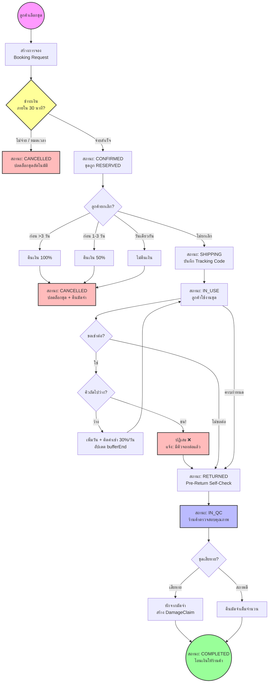

# MeeSai (ມີໃສ່) — รายงานความคืบหน้าโครงการ
### สำหรับผู้บริหาร DDC Groups / V-Group
### ณ วันที่ 10 กุมภาพันธ์ 2026 (ฉบับอัปเดต 22:26)

---

## 1. สถานะโครงการ

| รายการ | สถานะ |
|:--|:--|
| **Version** | `2.0.0-alpha.0` (MVP) |
| **URL Production** | https://meesai.vgroup.work |
| **Build** | ✅ Compile สำเร็จ 0 errors — 21 routes |
| **Infrastructure** | Docker 4 containers (App + PostgreSQL + MinIO + Redis) |
| **E2E Tests** | ✅ 30/30 passed (Playwright) |
| **Phase ปัจจุบัน** | Phase 2 Complete → พร้อม Commercial Launch |

---

## 2. สถาปัตยกรรมเทคโนโลยี

| ส่วนประกอบ | เทคโนโลยี | สถานะ |
|:--|:--|:--|
| Frontend | Next.js 16 (App Router) + Tailwind CSS v4 | ✅ พร้อมใช้ |
| Backend | Server Actions + Prisma 6 ORM | ✅ พร้อมใช้ |
| Database | PostgreSQL 16 (15+ tables) | ✅ พร้อมใช้ |
| Object Storage | MinIO (S3 Compatible) | ✅ พร้อมใช้ |
| Cache | Redis 7 | ✅ พร้อมใช้ |
| Auth | NextAuth v5 (Credentials) | ✅ พร้อมใช้ |
| Containerization | Docker + Docker Compose | ✅ พร้อมใช้ |
| Reverse Proxy | Nginx Proxy Manager + Cloudflare | ✅ พร้อมใช้ |
| ภาษา | 2 ภาษา (ລາວ / English) | ✅ พร้อมใช้ |

---

## 3. ฟีเจอร์ที่พัฒนาเสร็จแล้ว (ใช้งานได้จริง)

### 🛍️ ฝั่งลูกค้า (Renter Journey)

| ฟีเจอร์ | รายละเอียด | URL |
|:--|:--|:--|
| **หน้าแรก (Landing)** | Hero banner, Flash Rent, Daily Discover, หมวดหมู่ | `/lo` |
| **เรียกดูชุด (Browse)** | ค้นหา, ฟิลเตอร์ตามธีมงาน/รูปร่าง/ขนาด, เรียงตามราคา/ยอดนิยม, เช็คคิวว่าง Real-time | `/lo/browse` |
| **รายละเอียดชุด (Product Detail)** | แกลเลอรีรูป, ข้อมูลไซส์, เกรดสภาพ, รีวิว, เลือกวันเช่า | `/lo/browse/[id]` |
| **จองชุด (Checkout)** | Timeline การใช้งาน, สรุปค่าใช้จ่าย, เลือกวิธีชำระ, ยืนยันจอง | `/lo/checkout` |
| **สมัครสมาชิก / เข้าสู่ระบบ** | ลงทะเบียนด้วยเบอร์โทร, เข้าสู่ระบบด้วย Credentials | `/lo/register`, `/lo/login` |
| **บัญชีผู้ใช้ (Account)** | ข้อมูลส่วนตัว, แก้ไข Avatar | `/lo/account` |
| **การจองของฉัน (My Bookings)** | ดูสถานะจอง (9 states), Timeline ความคืบหน้า, ขยายเวลา | `/lo/account/bookings` |
| **Self-Check ก่อนคืน** | Checklist ตรวจสภาพ, อัปโหลดรูปหลักฐาน, เลือกวิธีส่งคืน | `/lo/account/bookings/[id]/return` |
| **โปรไฟล์ไซส์** | บันทึกตัวเลขร่างกาย (อก/เอว/สะโพก/ส่วนสูง) เพื่อแมทช์ชุด | `/lo/account/size-profile` |
| **กระเป๋าเงิน (Wallet)** | ยอดเงิน, ประวัติเข้า-ออก, เติมเงิน, ถอนเงิน | `/lo/account/wallet` |
| **รายการโปรด (Wishlist)** | บันทึกชุดที่ชอบ | `/lo/account/wishlist` |
| **SOS ช่วยเหลือฉุกเฉิน** | 4 สถานการณ์ฉุกเฉิน + ขั้นตอนแก้ไข + ปุ่มโทรด่วน | `/lo/sos` |

### 🏪 ฝั่งเจ้าของชุด / ร้านค้า (Partner Portal)

| ฟีเจอร์ | รายละเอียด | URL |
|:--|:--|:--|
| **Dashboard** | ภาพรวมร้าน, สถิติรายได้, จำนวนชุด, สถานะออเดอร์ | `/lo/partner` |
| **จัดการชุด (Inventory)** | รายการชุดทั้งหมด, สถานะ (AVAILABLE/RESERVED/RENTED/MAINTENANCE) | `/lo/partner/inventory` |
| **ออเดอร์ (Orders)** | ดูรายการจอง, อัปเดตสถานะ (ยืนยัน → จัดส่ง → รับคืน) | `/lo/partner/orders` |
| **ตรวจสอบคุณภาพ (QC)** | ถ่ายรูปก่อน/หลัง, บันทึกความเสียหาย, อัปเดตเกรดสภาพ | `/lo/partner/qc/[bookingId]` |

---

## 4. Database Schema — โครงสร้างข้อมูล

รวม **16 ตาราง** ออกแบบครบตาม 5 เสาเข็กเทคนิค:

```
├── Users & Auth
│   ├── User (4 roles: RENTER, OWNER, STAFF, ADMIN)
│   ├── Wallet + WalletTransaction (ระบบเงิน)
│   └── SizeProfile (ข้อมูลไซส์ร่างกาย)
│
├── Product Catalog
│   ├── Shop (ร้านค้า 1:1 กับ Owner)
│   ├── Category (หมวดหมู่: เดส, สิ้น, สูท, ชุดประเพณี)
│   ├── Garment (ชุดแฟชั่น + เกรดสภาพ A+/A/B/C)
│   └── GarmentImage (แกลเลอรีรูปชุด)
│
├── Booking Engine
│   ├── Booking (9 states FSM + Buffer Days)
│   ├── Review (rating 1-5 ดาว)
│   └── DamageClaim (รายงานความเสียหาย + ข้อพิพาท)
│
├── Promotions
│   ├── Coupon (คูปองส่วนลด)
│   ├── UserCoupon (คูปองที่ผู้ใช้เก็บ)
│   └── Wishlist (รายการโปรด)
│
└── System
    └── SystemConfig (ค่าตั้งระบบ)
```

---

## 5. Business Logic ที่สร้างเสร็จแล้ว

### 5.1 ระบบจองชุด (Booking Engine)

| Logic | สถานะ | รายละเอียด |
|:--|:--|:--|
| Concurrency Control | ✅ | ป้องกัน Double Booking ด้วย Time-based Locking + Prisma `$transaction` |
| Buffer Days | ✅ | เผื่อเวลาซัก-อบ-รีดอัตโนมัติ (ค่าตั้งต้น 2 วัน) |
| Overlap Detection | ✅ | เช็คว่าชุดว่างในช่วงที่ต้องการ Real-time |
| Fee Calculation | ✅ | คำนวณค่าเช่า + ค่าบริการ + ค่าส่ง + ค่าซัก + มัดจำ อัตโนมัติ |
| Payment Deadline | ✅ | Countdown หมดเขตชำระ (Auto-cancel ถ้าไม่จ่าย) |

### 5.2 Finite State Machine (FSM) — แผนภาพการไหลของระบบ



### 5.3 ระบบอื่นๆ

| ระบบ | สถานะ |
|:--|:--|
| แมทช์ชุดตามรูปร่าง (Body Type Matching) | ✅ |
| แมทช์ชุดตามธีมงาน (Event Theme) | ✅ 9 ธีม: งานดอง, งานบุญ, ราตรี, เพื่อนเจ้าสาว, สำเร็จการศึกษา, ธุรกิจ, ปาร์ตี้, ลำลอง, อื่นๆ |
| เกรดสภาพชุด (Condition Grading) | ✅ A+ / A / B / C พร้อมบันทึกจุดบกพร่อง |
| ค่าส่งไซส์สำรอง (Backup Size Fee) | ✅ |
| ระบบ Pre-Return Self-Check | ✅ อัปโหลดรูปก่อนคืน + Checklist |
| ระบบ Damage Claim | ✅ รายงาน + ประเมินค่าเสียหาย + สถานะข้อพิพาท |
| ระบบ Wallet (เงินเข้า-ออก) | ✅ เติมเงิน, ถอนเงิน, ประวัติธุรกรรม |
| ระบบ Coupon | ✅ คูปองร้านค้า + Platform-wide |
| **ยกเลิกการจอง (Cancel Booking)** | ✅ Refund Policy 3 ระดับ: คืน 100% (>3 วัน), 50% (1-3 วัน), 0% (วันเดียวกัน) + ปลดล็อกชุด + คืนมัดจำ |
| **ขอเช่าต่อ (Extend Rental)** | ✅ เช็คคิวชนก่อนเลื่อน + จำกัด 1-7 วัน + คิดค่าเช่าเพิ่ม 30%/วัน |

---

## 6. คุณภาพ & ความมั่นคง

| หมวด | ผลลัพธ์ |
|:--|:--|
| **Build** | ✅ 0 errors — Next.js 16 Turbopack |
| **E2E Testing** | ✅ 30/30 test cases passed (Playwright) |
| **Security** | Auth middleware ป้องกันทุกหน้าที่ต้อง Login |
| **RBAC** | 4 roles (RENTER / OWNER / STAFF / ADMIN) แยก Permission ชัดเจน |
| **Input Validation** | Zod schema validation ทุก Server Action |
| **i18n** | 2 ภาษาครบ (ลาว / English) — URL-based routing |
| **Responsive** | รองรับ Mobile / Tablet / Desktop |

---

## 7. UI & ภาพลักษณ์

| รายการ | สถานะ |
|:--|:--|
| **ธีม** | Luxury Bright — ขาว/ทอง/กรมท่า (Shopee-inspired UX) |
| **รูปภาพ** | AI-generated 11 ภาพคุณภาพสูง (Hero banner + 10 garments) |
| **Animation** | Micro-animations, Card hover effects, Fade-in transitions |
| **Font** | Professional Thai/Lao-compatible typography |

---

## 8. Infrastructure & Deployment

```
┌─────────────────────────────────────────────┐
│           Cloudflare (CDN + SSL)            │
│              meesai.vgroup.work              │
└──────────────────┬──────────────────────────┘
                   │
┌──────────────────▼──────────────────────────┐
│        Nginx Proxy Manager (:80/443)        │
└──────────────────┬──────────────────────────┘
                   │
┌──────────────────▼──────────────────────────┐
│          Docker Compose Stack               │
│                                              │
│  ┌─────────────┐  ┌──────────────────────┐  │
│  │ meesai-app  │  │ PostgreSQL 16        │  │
│  │ :4200→3000  │  │ :4203→5432           │  │
│  └─────────────┘  └──────────────────────┘  │
│                                              │
│  ┌─────────────┐  ┌──────────────────────┐  │
│  │ MinIO       │  │ Redis 7              │  │
│  │ :4204→9000  │  │ :4206→6379           │  │
│  └─────────────┘  └──────────────────────┘  │
└──────────────────────────────────────────────┘
```

---

## 9. สิ่งที่ยังเหลือ (Phase 3 — Commercial Launch)

| หมวด | รายการ | Priority |
|:--|:--|:--|
| **Payment** | เชื่อมต่อ Payment Gateway (BCEL One / QR Code) | 🔴 สูง |
| **Notification** | LINE OA / SMS แจ้งเตือนสถานะจอง | 🔴 สูง |
| ~~**Cancel Booking**~~ | ~~ยกเลิกจอง + Refund Policy~~ | ✅ เสร็จแล้ว |
| ~~**Extend Overlap**~~ | ~~เช็คคิวชนก่อนขยายเวลา~~ | ✅ เสร็จแล้ว |
| **Admin Panel** | Dashboard สำหรับ Admin จัดการ User + รายงาน | 🟡 กลาง |
| **Owner Payout** | ระบบจ่ายเงินให้เจ้าของชุดอัตโนมัติ | 🟡 กลาง |
| **Search Enhancement** | Full-text search + ค้นหาด้วยรูป (AI) | 🟢 ต่ำ |
| **Mobile App** | PWA หรือ React Native สำหรับ iOS/Android | 🟢 ต่ำ |

---

## 10. สรุปสำหรับผู้บริหาร

> **"แพลตฟอร์ม MeeSai V2 พัฒนาจบ Phase 2 (Platform Ready) — ระบบทั้งหมดทำงานได้จริง บน Production Server"**

### ✅ สิ่งที่ทำเสร็จแล้ว:
- แพลตฟอร์มเช่าชุดออนไลน์ **21 หน้า** ครบ Customer Journey (ค้นหา → จอง → ชำระ → รับคืน)
- ระบบ **Partner Portal** สำหรับเจ้าของชุด (จัดการ Inventory + ออเดอร์ + QC)
- **Database 16 ตาราง** ออกแบบตามมาตรฐาน Enterprise
- **5 เสาเข็กเทคนิค** (Concurrency, FSM, Unique ID, Ledger, Audit Trail) ทำงานครบ
- **30 E2E Test Cases** ทดสอบผ่านทั้งหมด
- Deploy บน **Production** พร้อม Domain + SSL: https://meesai.vgroup.work

### ⏭️ ขั้นตอนถัดไป:
1. เชื่อมต่อ **Payment Gateway** (BCEL One)
2. ตั้งค่า **LINE OA** สำหรับแจ้งเตือน
3. เปิดรับสมัคร **เจ้าของชุด (Partner)** รอบแรก
4. **Soft Launch** ในนครหลวงเวียงจันทน์

---

*จัดทำโดย: ทีมพัฒนา MeeSai — DDC Groups / V-Group*
*วันที่: 10 กุมภาพันธ์ 2026*
